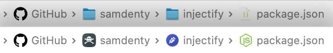

# repositories-app

**This project is super WIP, and not ready for usage yet.**

A Mac app which allows you to access any file / folder on github, without cloning.

Creates a virtual `GitHub` folder in your home directory. Files from repos can be accessed using paths like `~/GitHub/username/repo/README.md`. When filesystem operations are performed, the results are cached and persisted to a local database.

All user folders have icons sourced from GitHub:

Repo folders have icons sourced from automatically crawling the linked website / README:

And all files use the same icon pack that you use in your IDE:

## Chrome extension

A chrome extension allows you to right click on any file on GitHub and open it instantly in Finder, VSCode etc. without cloning.

